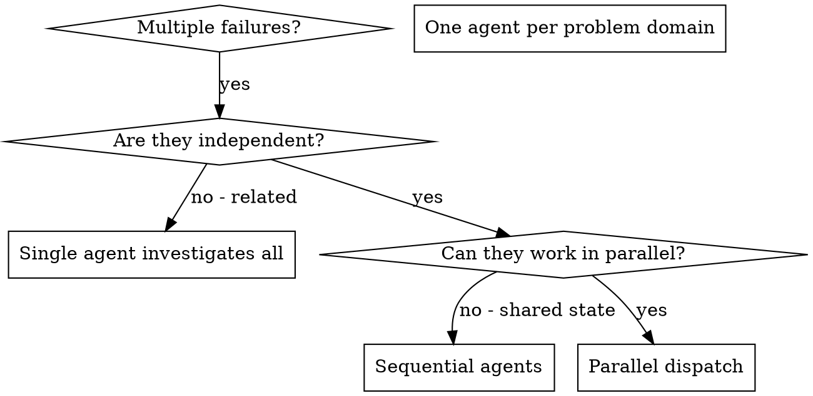

# Dispatching Parallel Agents

## Overview

When you have multiple unrelated failures (different test files, different subsystems, different bugs), investigating them sequentially wastes time. Each investigation is independent and can happen in parallel.

**Core principle:** Dispatch one agent per independent problem domain. Let them work concurrently.

## When to Use



**Use when:**
- 3+ test files failing with different root causes
- Multiple CI jobs failing independently
- Multiple subsystems broken independently
- Each problem can be understood without context from others
- No shared state between investigations

**Don't use when:**
- Failures are related (fix one might fix others)
- Need to understand full system state
- Agents would interfere with each other
- Purely flaky infrastructure — retry or fix workflow config first

## The Pattern

### 1. Identify Independent Domains

Group failures by what's broken:
- File A tests: Tool approval flow
- File B tests: Batch completion behavior
- File C tests: Abort functionality

Each domain is independent — fixing tool approval doesn't affect abort tests.

### 2. Create Focused Agent Tasks

Each agent gets:
- **Specific scope:** One test file, one CI job, or one subsystem
- **Clear goal:** Make these tests pass / fix this CI job
- **Constraints:** Don't change other code
- **Expected output:** Summary of what you found and fixed

### 3. Dispatch in Parallel

Launch all subagents in a **single message** so they run concurrently:

```typescript
Task("Fix agent-tool-abort.test.ts failures")
Task("Fix batch-completion-behavior.test.ts failures")
Task("Fix tool-approval-race-conditions.test.ts failures")
```

### 4. Review and Integrate

When agents return:
- Read each summary
- Verify fixes don't conflict
- Run full test suite / CI equivalent
- Integrate all changes

## Agent Prompt Structure

Good agent prompts are:
1. **Focused** — One clear problem domain
2. **Self-contained** — All context needed to understand the problem
3. **Specific about output** — What should the agent return?

```markdown
Fix the 3 failing tests in src/agents/agent-tool-abort.test.ts:

1. "should abort tool with partial output capture" - expects 'interrupted at' in message
2. "should handle mixed completed and aborted tools" - fast tool aborted instead of completed
3. "should properly track pendingToolCount" - expects 3 results but gets 0

These are timing/race condition issues. Your task:

1. Read the test file and understand what each test verifies
2. Identify root cause - timing issues or actual bugs?
3. Fix by:
   - Replacing arbitrary timeouts with event-based waiting
   - Fixing bugs in abort implementation if found
   - Adjusting test expectations if testing changed behavior

Do NOT just increase timeouts - find the real issue.

Return: Summary of what you found and what you fixed.
```

## Common Mistakes

**Too broad:** "Fix all the tests" — agent gets lost
**Specific:** "Fix agent-tool-abort.test.ts" — focused scope

**No context:** "Fix the race condition" — agent doesn't know where
**Context:** Paste the error messages and test names

**No constraints:** Agent might refactor everything
**Constraints:** "Do NOT change production code" or "Fix tests only"

**Vague output:** "Fix it" — you don't know what changed
**Specific:** "Return summary of root cause and changes"

## When NOT to Use

**Related failures:** Fixing one might fix others — investigate together first
**Need full context:** Understanding requires seeing entire system
**Exploratory debugging:** You don't know what's broken yet
**Shared state:** Agents would interfere (editing same files, using same resources)

---

## Recipe: Fixing Test Failures

Speed up fixing a broken test suite by distributing failing test files across parallel subagents.

### 1. Run the Full Test Suite

```bash
npm test -- --no-coverage 2>&1 || true
```

Capture the output and extract all failing test files.

### 2. Group Failures by File

Parse the test output for failing files:
- Jest: `FAIL src/components/Button.test.tsx`
- Vitest: `FAIL src/utils/format.test.ts`
- Pytest: `FAILED tests/test_api.py::test_create_user`

Group by file — each file becomes one task. If two failing tests share the same source file, assign them to the **same** subagent to avoid edit conflicts.

### 3. Launch Subagents

For each failing test file, launch a `generalPurpose` subagent:

```
Task: Fix the failing tests in <file>

The test file is: <path>
The test command is: <command to run just this file>
The error output was:
<paste the relevant failure output>

Steps:
1. Read the test file and the source file it tests
2. Understand why each test is failing
3. Fix the source code (preferred) or update the test if the test is wrong
4. Run the single test file to confirm it passes
5. Report what you changed and why
```

### 4. Verify

Run the full test suite one more time to confirm everything passes. If there are new failures from conflicting fixes, resolve them sequentially.

### Tips

- For large test suites (50+ failures), batch into groups of 5-10 per subagent rather than one-per-file
- Set a timeout — if a subagent is stuck for 5+ minutes, check its progress
- Use `best-of-n-runner` subagents if you want isolated worktrees for each fix attempt

---

## Recipe: CI Triage

Speed up fixing broken CI by splitting failing **jobs** across parallel subagents. Each subagent owns one vertical slice: logs, root cause, code fix, and local verification.

### Prerequisites

- **GitHub CLI** (`gh`) installed and authenticated, or copy logs manually from the GitHub UI.
- Push access to the repo so fixes can be pushed and CI re-run.

### 1. Identify the Failing Run

```bash
gh run list --limit 5
gh run view <RUN_ID> --log-failed
```

Or open the Actions tab and note which **jobs** failed (group by job name, not step).

### 2. Split by Job

- **One subagent per failed job** when jobs test different things (e.g. `lint`, `test-node-18`, `e2e`).
- **One subagent per independent failure cluster** when a single job logs multiple unrelated errors.
- If two failures share the same root cause in the same file, assign **one** subagent to fix both.

### 3. Launch Subagents

For each failing job, launch a `generalPurpose` subagent:

```
Task: Fix CI failure for job "<JOB_NAME>"

Context:
- Workflow run: <RUN_URL or RUN_ID>
- Branch: <branch>
- Relevant log excerpt (failed steps only):
<paste gh run view --job <JOB_ID> --log or the failed section>

Instructions:
1. Infer the root cause from the log (command, stack trace, file:line).
2. Open and edit only what this job requires.
3. Run the same commands locally that failed in CI (or the narrowest equivalent).
4. Report: what failed, what you changed, and confirmation that the local command passes.
```

Include the **exact** failing command and error lines so the subagent does not guess.

### 4. Merge and Verify

- Collect each subagent's changed files. Resolve overlaps manually if two agents touched the same file.
- Run the full CI-equivalent locally:

  ```bash
  npm run lint && npm test
  ```

- Commit, push, and watch the workflow:

  ```bash
  gh run watch
  ```

### Notes

- Redact secrets if pasting logs into chat.
- If agents conflict on shared files, merge sequentially after the parallel pass.
- A single job with one clear error doesn't need this recipe — fix it directly.

---

## Verification

After agents return:
1. **Review each summary** — Understand what changed
2. **Check for conflicts** — Did agents edit same code?
3. **Run full suite** — Verify all fixes work together
4. **Spot check** — Agents can make systematic errors

## Key Benefits

1. **Parallelization** — Multiple investigations happen simultaneously
2. **Focus** — Each agent has narrow scope, less context to track
3. **Independence** — Agents don't interfere with each other
4. **Speed** — N problems solved in time of 1

## Real Example

**Scenario:** 6 test failures across 3 files after major refactoring

**Failures:**
- agent-tool-abort.test.ts: 3 failures (timing issues)
- batch-completion-behavior.test.ts: 2 failures (tools not executing)
- tool-approval-race-conditions.test.ts: 1 failure (execution count = 0)

**Decision:** Independent domains — abort logic separate from batch completion separate from race conditions

**Dispatch:**
```
Agent 1 → Fix agent-tool-abort.test.ts
Agent 2 → Fix batch-completion-behavior.test.ts
Agent 3 → Fix tool-approval-race-conditions.test.ts
```

**Results:**
- Agent 1: Replaced timeouts with event-based waiting
- Agent 2: Fixed event structure bug (threadId in wrong place)
- Agent 3: Added wait for async tool execution to complete

**Integration:** All fixes independent, no conflicts, full suite green
